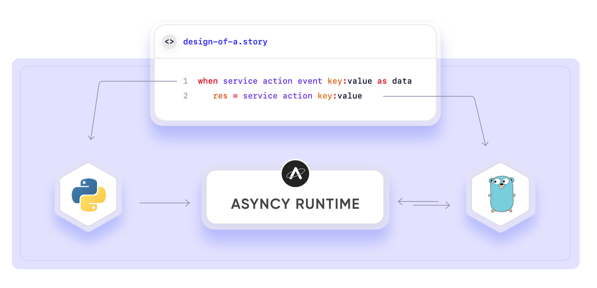

# Storyscript

Strings together microservices and functions in a serverless way with Storyscript, the top-level programming language for **Application Storytelling**™ on Asyncy.

The foundation of Storyscript is **moving data by pull or push**. In the diagram below we have two lines of code: one that represents data being pushed into a Story (e.g., streams and events) and the next line representing data being pulled from a service (e.g., http get).



::: tip The Syntax
**Natural, familiar and intuitive**; Storyscript is inspired by the Zen of Python, the beauty of Ruby, the declarative nature of Swift and some flavors from other popular languages.
:::

Many think of Storyscript as glue code for microservices, flow code, low-code, or pure business-logic programming. We call this **top-level programming**. The diagram shows how the language focuses on the most important aspect of application development: the business-logic.


**Key value propositions**
1. **Transparency**; It looks like a monolith but is a full microservice/function serverless architecure.
1. **Readability**; The truth is in the code. Not only is Storyscript easy to read it's also easy to refactor, add features and traceback errors.
1. **Polyglot**; Storyscript connects all languages together in one cohesive story of data. Choose the right language for the job.
1. **Zero-devops Deployments**; No Kubernetes configuration, port bindings, ingress controllers, central message queue, no container coupling, no infra configuration or custom scaling.


> Storyscript **amplifys the developer** to program robust, scalable backend applications in a fraction of the time by focusing on what matters most: the story of data, *everything else is noise*.

# Table of Contents
[[toc]]

## Why Storysctipt?

The world is becoming more and more integrated. Businesses rely on hundreds of interconneted software to power their business and create their own products. In fact, all business today are software focused, internally and externally. Yet, here in lays a problem that many tools have sought to solve over the decade, simply put: connect service A to service B. Sounds trivial, but this is what software is all about. Connect database to http server to cron jobs to queue systems to a machine learning module. It's all a service at the end of the day and the data movement, specifically the unique way you move the data is your secret sauce.

Storyscript is pure business-logic. Our intentions with the langauge is to be the go-to programming langauge to design all things cloud native and deliver your product with greater transparency of data flow in a fraction of the time to market.

## Use Cases

All things backend can be created in one line of code. No devops, no boilerplate code, no management or custom scaling.

1. **HTTP Requests and API's** -- `when http server listen ...`
2. **Websockets** -- `when websocket server connects ...`
3. **Cron** -- `when schedule cron daily ...`
4. **Event-driven** -- `when slack bot responds ...`
5. **IoT Events** -- `when iotDevice stream doorBellRang ...`
6. **Social Media** -- `when twitter stream tweets ...`
7. **Machine Learning** -- `result = machinebox/textbox analyze text:'...'`
8. **Microservices Orchestration** -- `output = serviceName action key:value` any langauge in a Docker container
9. **Functions Orchestration** -- `output = myFunction(key:value)` powered by OpenFaaS
10. **CI/CD Pipelines** -- `ci_result = jenkins run ...`
11. **Video Manipulation** -- `video = ffmpeg compress video:... codec:'h265'`
12. **Image Manipulation** -- `image = imagemagic scale input:... size:'150x150'`
13. **Fully-Asynchronous Programming** -- Network-bound, io-bound, time-bound, and event-bound.
14. **Multi-Cloud Deployments** -- Thanks to products like [Upbound](https://upbound.io)

## Syntax Cheatsheet

```coffeescript
###
Meet Storyscript
###

# Pull data from a microservice
output = service action key:value
output = team/service action key:value
# Discover and create services in the Asyncy Hub

# Call a function
output = function_name(key:value)
# A Storyscript function
# or another programming langauge

# Call type methods
output = variable mutation key:value

# Event streaming microservice
when service action event key:value as output
    ... # run this block for every event

# Types
string = "Hello"
integar = 1
number = 1.3
bool = true
list = ['a', 'b', 'c']
map = {'apple': 'red', 'banana': 'yellow'}
regexp = /^foobar/
empty = null
time = 1d35m

# Destructuring
{ apple, banana } = map
# apple = 'red'

# Conditions
if one > 1
    # ...
else if one == 1
    # ...
else
    # ...

# Loops
foreach list as item
    # ...
while true
    # ...

# Functions
function name input:int returns int
    # ...
    return input
name(input:1)
# >>> 1
```

## Semantics

### Procedure

```coffeescript
output = functionA(key:(functionB(key:(functionC(...)))))
```

Parentheses MUST be used to produce inline procedures. The innermost Parentheses will be executed first moving out to the outermost.

Same level parentheses MAY be called at the same time which done by parallel processing in new threads.

First set of parentheses when assigning variables is optional. E.g., `a = my_list length` is the same as `a = (my_list length)`.

### Attributes, methods and entries

Objects may have attributes and methods. A Map can *only* have entries.

1. `Object` attributes can **only** be accessed using a period character (`.`) as in `user.name`.
1. `Object` methods can **only** be accessed using a space character (` `) as in `cart add item:...`.
1. `Map` entries can **only** be accessed using brackets and strings (`['key']`) as in `some_map['key']`

The example below illustrates how the object `tweet` has attributes and methods.

```coffeescript
tweet = twitter tweet text:'Hello world'
id = tweet.id  # returns the tweet id 123456 of type int.
tweet like     # calls "like", a method of tweet
```

### Mutations
Mutations refer to running operations on the built in data types, such as strings, arrays, maps, and numbers.
```coffeescript
# Strings
# Note: None of the string operations below change the original string in any form
str = ''
str length  # returns the number of UTF-8 characters
str replace pattern: 'ab' by: 'AB'  # returns a string by replacing 'ab' with 'AB'
str replace pattern: /ab/ by: 'AB'  # same as above
str split by: '.'  # returns an array by splitting the string with the delimiter
str uppercase  # returns a string where all characters are upper cased
str lowercase  # returns a string where all characters are lower cased
str capitalize  # returns a string where the first letter of each word is capitalized (eg: 'jane smith' becomes 'Jane Smith')

# Numbers
num = 10
num is_odd  # returns false
num is_even  # returns true
num absolute  # returns the absolute value (if num was -1, this would return 1)
num increment  # returns 11. Note that num is not changed
num decrement  # returns 9. Note that num is not changed

# Arrays
arr = [1, 2, 3, 4, 5]
arr index of: 5  # returns the index of an element, 4 in this case
arr length  # returns the length of the array, 5 in this case
arr append item: 6  # adds 6 to the end of the array
arr prepend item: 1  # adds 1 to the start of the array
arr random  # returns a random element from this array
arr reverse  # reverses the array in-place
arr sort  # sorts the array in an ascending fashion
arr min  # returns the lowest of the elements in this array (if it contains numbers)
arr max  # returns the largest of the elements in this array (if it contains numbers)
arr sum  # returns the sum of all the elements in this array (if it contains numbers)
arr unique  # reduces the array to contain only unique items
arr contains item: 3  # returns true if 3 is present, false otherwise
arr remove item: 3  # removes the item specified from the array

# Maps
m = {'a': 1, 'b': 2}
m size  # returns the size of the map, 2 in this case
m keys  # returns an array of all keys
m values  # returns an array of all values
m flatten  # returns a list of key/value pairs (eg: [['a', 1], ['b', 2]])
m pop key: 'a'  # removes and returns the value for key 'a'
m get key: 'b'  # returns the value for the key 'b'
m contains key: 'c'  # returns true if the key 'c' exists in the map, false otherwise
```

#### Chaining Mutations

Mutations can be chained to help reduce complexity.

```coffeescript
'abc' uppercase split
# >>> ['A', 'B', 'C']

'abc' uppercase
      then split
# >>> ['A', 'B', 'C']

('abc' uppercase) split
# >>> ['A', 'B', 'C']
```

### Variable Scope

Variables are not global.

```coffeescript
n = 1

function incr
  n = n + 1
    # ^ Error: variable `n` is undefined.
```

Functions do not have access to variables outside their scope.
All variables must be provided as arguments.

```
Error: syntax error in story at line 4, column 7

4|      a = n + 1
            ^

E0101: Variable `n` has not been defined.
```

### Compiling

Storyscript is a dynamically compiled language. Type checking is performed at compile time, but not in a traditional way. From the perspective of the developer the following steps are performed during compile time.

Compile time consists of four primary processes:

1. **Linting** is performed to check syntax and grammar.
1. **Translation** is performed which translates the Storyscripts into event-logic tree.
1. **Dependency** checks are performed to ensure command and arguments exists.
1. **Type-Checking** is performed on the Stories the ensure data integrity.

The type-checking includes the following checks:

1. Type mutation method exists.
1. Arguments are of the expected type.


### Environment Variables (aka Secrets)

Environment variables are stored in a restricted keyword `app.secrets`.

Set secrets with the Asyncy CLI
```shell
asyncy config set foo=bar
```

Then you may access them via `app.secrets` map, like this:
```coffeescript
if app.secrets.foo == 'bar'
    ...
```

::: tip 💡Hint
Secrets are case insensative. `app.secrets.FOO` is the same as `app.secrets.foo`.
:::

### Service Variables

May services require environment variables, such as oauth tokens and client id/secret pairs.

Service variables are ALWAYS unique to that service and cannot be accessed by any other service or within Storyscript secrets.

Set secrets with the Asyncy CLI
```shell
asyncy config set twitter.client_id=abc123
```

These variables ARE NOT accessible in Storyscript because they are for a service only.
```coffeescript
token = app.secrets.twitter.client_id  # Error. Accessing service environment variables is prohitted.
```

When the service `twitter` is started by Asyncy it will be assigned `client_id=abc123` accoring to it's `microservice.yml` as an environment variable.

### Execution Model

Storyscripts are executed by the Asyncy Runtime (not compiled to C or Java or any other langauge).
This gives Storyscript distinct advantages over General Purpose Programming Languages (GPPL) with little to no performance overhead since you can use any other GPPL for data processing (low and high-level programming).

#### Deployment

1. All dependencies are gathered and prepared for execution.
1. The Asyncy Runtime is prepared with the Stories as first-class assets for swift execution.
1. Every Storyscript is executed allowing them to register with event-based services.

#### Execution

A story may [execute in many ways](/faq/#how-are-storyscripts-started).

1. The Runtime received notice to start a Story with or without starting arguments.
1. The Story is executed in a single thread.
1. When a service is called the Runtime will communicate with the service passing necessary data to and from the service back into the primary thread.
1. Asynchronous commands may generate new threads and execute in the same pattern above.

```coffeescript
translated = service action translate:my_string to:'spanish'
parts = translated split by:' '
service_b action name:parts[0]
```

The Story above is would perform the following operations:

1. Translate a string to Spanish
1. Split the translated string by whitespace
1. Assign `first_word` to the first word in the `parts` array


## Strings

```coffeescript
data = "foobar"

long_string = "Hi Friend,
This is a lo\
ng string."
# Hi Friend, This is a long string.

more_data = """
    The quick brown fox
    jumps over the lazy dog.
"""
# The quick brown fox\njumps over the lazy dog.

where = "Earth"
data_formatted = "Hello, {where}"
# Hello, Earth
```

::: v-pre
Like many traditional programming languages, Storyscript supports strings as delimited by the `"` or `'` characters.
Storyscript also supports string interpolation within "-quoted strings, using `{ expression }`.
Single-quoted strings are literal. You may even use interpolation in object keys.
:::

Multiline strings are allowed in Storyscript.
Lines are joined by a single space unless they end with a backslash.
Indentation is ignored.

Block strings, delimited by `"""` or `'''`, can be used to hold formatted or indentation-sensitive text (or, if you just don’t feel like escaping quotes and apostrophes).
The indentation level that begins the block is maintained throughout, so you can keep it all aligned with the body of your code.

Double-quoted block strings, like other double-quoted strings, allow interpolation.

## Numbers

Numbers in Storyscript can be whole numbers (`int`s) that can be positive, negative or zero:

```coffeescript
i  = 1
i2 = -2
i3 = 0
```

Additionally, Storyscript can represent numbers with decimals as floating-point numbers (`float`):

```coffeescript
f1 = 1.2
f2 = -3.14
```

## Boolean

Truth values can be represented with the `boolean` type that has two possible values (`true` and `false`):

```coffeescript
happy = true
sad = false
```

## Lists

Storyscript supports `List`s as a generic container type:

```coffeescript
list_inline = ["string", 1, 2]
list_multiline = [
  1,
  2,
  3
]
```

In a list the same value may occur more than once.

## Maps

Storyscript supports `Map`s as a generic container type:

```coffeescript
map_inline = {'foo': 'bar', 'apples': 'oranges'}
map_multiline = {
  'foo': 'bar',
  'apples': 'oranges'
}
object_int = {1: 11, 2: 22}
```

In a map the same value may occur more than once, but the same key can only occur once.

## Conditions

```coffeescript
if foo == bar
  # more stuff here
else if foo > bar
  # more stuff here
else
  # more stuff here

if (foo > 0 and cat == dog) or foobar contains item: /regexp/
  # more stuff here
```

`if`/`else` statements can be written without the use of parentheses and curly brackets. As with functions and other block expressions, multi-line conditionals are delimited by indentation.

## Looping

Looping through index and/or object keys.

```coffeescript
foreach my_list as item
    # ...

foreach my_list as index, item
    # ...

foreach my_object as key
    # ...

foreach my_object as key, value
    # ...

while foobar
    # ...
```

Similarly to conditions, loop blocks can use arbitray expressions:

```
foreach "a.b.c" split by: "." as item
    # ...
```

Loops have reserved keywords for ending (`break`) and continuing loops (`continue`).

```coffeescript
foreach my_list as item
    if do_end_loop
        break
    if do_skip_to_next_item
        continue
    # ...
```


## Functions

Repeating code blocks can be grouped into functions for better reusability and modularity:

```coffeescript
function get_user id:int returns map
    someone = (psql exec query:'select * from users where id={id} limit 1;')[0]
    someone['contact'] = fullcontact person email:someone['email']
    return someone

user_a = get_user(id:7)
user_b = get_user(id:10)
```

The example above is a function what queries the database and also downloads their `FullContact` profile.

Function must define their inputs and outputs which help with transparency, autocomplete and type checking during the Asyncy CI process.

Functions **MAY** declare one output and identify it's type. If an output type is used the function **MUST** use `return` and return that type.

```coffeescript
function add this:int that:int returns int
   return this + that
```

Functions that do not have an output may not use `return` with an entity.
An error is thrown if a return is used. An sole `return` statement is allowed.

```coffeescript
function do_this
    # ...

function do_that
    return 1
>>> Error: syntax error in story at line 5, column 12

5|        return 1
                 ^

E0110: Function has no return output defined. Only `return` is allowed.
```


## Services

A service is a containerized microservice that is registered in the [Asyncy Hub](https://hub.asyncy.com). Discover hundreds of services in the Hub or build your own in any language, submit to the Asyncy Hub and call it in your Storyscript like this:

```coffeescript
# Call a service with a command and all arguments named
service cmd key:value foo:bar
tean/service cmd key:value foo:bar

# Service output assigned to variable
foobar = service cmd key:value

# Arguments may by indented under the service
service cmd key:value
            foo:bar
```

In Storyscript, the syntax to run a service appears natural and arguments are named for transparency.
Variable shorthands can be used to reduce repeating terms, ie `data:data` or `name:name`.

```coffeescript
message = "hello"
twitter tweet :message
# would result in ```twitter tweet message:"hello"```
```

Service, actions and argument names are **static grammar** and **interpreted literally**.

## Event-Based Services

Services may publish events which run a new block of logic.

```coffeescript
# All three patterns below are equivelent
when service action event key:value as output
    ...

service action as client
    when client event key:value as output
        ...
    # more events ...

service action
    when event key:value as output
        ...
    # more events ...
```

A good example of this is streaming Tweets by hashtag.

```coffeescript
when twitter stream tweets track:'programming' as tweet
    res = machinebox/textbox analyze input:tweet.message
    if res.sentiment == 'positive'
        tweet reply message:'Thank you!'
        tweet retweet
        tweet like
```

Every new tweet will be passed into the block below in the variable `tweet`.
Then machine learning will determine if the tone of the tweet's message is good or bad. The streaming service will wait for new tweets until the story is ended.

If no output is defined, it will be implicitly default to the name of the command. Furthermore, if only a command name is used in `when` blocks, it will use the `output` of its parent as subscribing service.
This allows this to shorten the example from above:


## Operations

```coffeescript{2}
if something_went_wrong
    end story
```

Use `end story` to stop the story and exit now.


## Exception Handling

```coffeescript
try
  # more stuff here
catch as error
  # more stuff here
finally
  # more stuff here
```

In Storyscript, the `try` expressions catch exceptions and pass the error to the `catch` block.

The `finally` block is **always** entered regardless of an exception being raised or not, use it for cleanup commands.

You may omit both the `catch` and `finally`.

```coffeescript
try
  # more stuff here
catch as error
  # more stuff here
  throw
```

Use the `throw` keyword to raise the exception, bubbling up to the next try block or stopping the story.

## Time durations

Time durations can be expressed natively.

```coffeescript
timeout  = 30s
duration = 5d10m
```

Supported time units are `w` (weeks)`, `d` (days), `h` (hours)`, `m` (minutes), `s` (seconds) and `ms` (milliseconds).

Time units must be used in this order and can't be repeated.

## Regular Expressions

```coffeescript
pattern = /^foo/i
```

Regular expressions are supported without any special characters of escaping necessary.

### Regular Expressions Methods

```coffeescript
pattern = /(?P<key>\w):(?P<value>\w)/
```

::: tip Info
Learn the methods you can call with regular expression in the [Asyncy Hub](https://hub.asyncy.com)
:::

## Types

```coffeescript
1 type
# int

true type
# bool

"" type
# string

[] type
# list

{} type
# object

null type
# null

30s type
# time

(date now) type
# date

(interval days:1) type
# interval

(range from:foo to:bar) type
# range

/^foobar/ type
# regexp

function foobar returns int
    return 1

foobar type
# function
```

Use the method `type` to get the type of a variable as a string.

```coffeescript
(1 is int) and (true is bool) and ("" is string)
# true

([] is list) and ({} is object)
# true

(1 is number) and (1.2 is number)
# true

{} is string
# false
```

## Type checking

Storyscript allows a few implicit type conversions:

- boolean types are implicitly convertible to `int`
- integer types are implicitly convertible to `float`
- all types are implicitly convertible to `any`
- all types are implicitly convertible to `string` in a string addition

If a type is unknown, the Storyscript compiler will infer it to `any`.
All operations of an `any` type with any other type result in an `any` type.


## Comments

```coffeescript
###
Large
  Comment
Block
###

# Inline comment

foo = "bar"  # end of line comment
```

In Storyscript, comments are denoted by the `#` character to the end of a line,
or from `###` to the end of the line of the next appearance of `###`.


## Application Information

Storyscript has access to application level information under the keyword `app`, containing the following details:

```coffeescript
app.secrets   # map of environment variables set via the CLI (more below)
app.hostname  # the full http dns hostname where your application is located
              # e.g, "smart-einstein-1235.asyncyapp.com"
app.version   # the release number of the application (see "asyncy releases list" for releases)
              # e.g, "v1"
```
