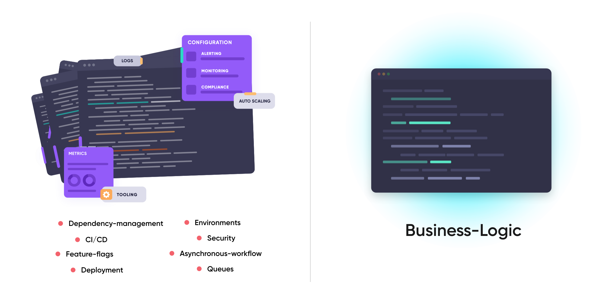
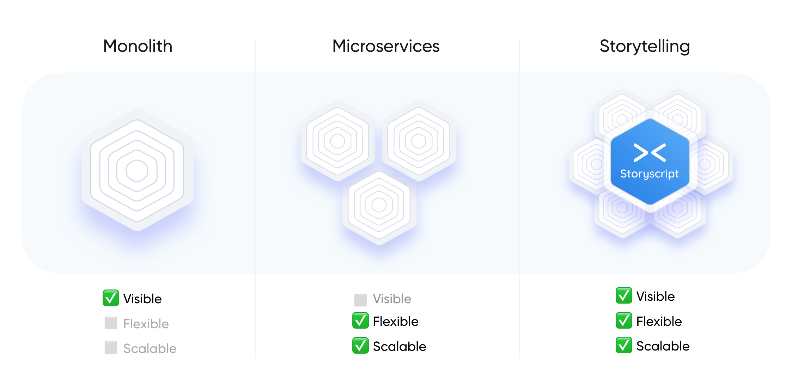

# Introduction

## Meet Storyscript

Storyscript is the first top-level programming langauge that seamlessly connects microservices and functions together in a serverless way. We call this **Application Storytelling**™.

The design of Storyscript is to **move data**, with no boilerplate code, in a declarative and intuitive way.

::: tip Inspiration behind Storyscript
Storyscript is inspired by many popular languages to be as natural and intuitive as possible. It is declarative, strong-typed, static-typed and focused on top-level data-flow.
:::


### Example Syntax & Explanation

In the example below we have two lines of code:

1. The first line represents event data, being pushed from a microservice.
2. The second line represents taking action on the incoming event data, harnessing another microservice.


```coffeescript
when service action event key:value as event  # Event-driven microservice
  res = service action key:value              # HTTP/RPC microservice
  result = someFunction(key:value)            # Any GPPL/Storyscript Function
  someString.upper()                          # A type transformation
```

Each service can be written in an independentent programming language, as they both adhere to the [OMG Standard](https://microservices.guide/), which Storyscript is built around.

Upon deployment, your **story** (the story of your data) gets compiled and translated into a production-ready Kubernetes data pipeline, ready to respond to incoming events, of any type. No configuration required. It's the best of all worlds — you get all the benefits of Kubernetes (open cloud, etc), without any of the headaches!

Many think of Storyscript as glue code for microservices, flow-code, or pure business-logic programming. We call this **top-level programming**. This diagram shows how the language focuses on the most important aspect of application development: the business-logic.




### Storyscript Language Values

1. **Transparency**.
  It looks like a monolith but is a full microservice/function serverless architecure.
1. **Readability**.
  The truth is in the code. Not only is Storyscript easy to read it's also easy to refactor, add features and traceback errors.
1. **Polyglot**.
  Storyscript connects all existing languages together into one single cohesive story of data. This enables you to choose the right language for the job.
1. **Zero-devops Deployments**.
  When using Storyscript, Kubernetes configuration is an afterthought: port bindings, ingress controllers, central message queues, container couplings, infrastructure configuration, and custom scaling. Focus on what matters most.



## Why Storyscript?

The developer dream is to build software like Legos; writing code as a story of data between well orchestrated services with the least amount of boilerplate and complexity.

The goal of Storyscript is to be the thread that connects everything from a top-level design: API's, databases, functions, and microservices.

We believe a language that connects polyglot services provides the most inclusive and unified platform opposed to focusing on extending one language which further fractures the many tribes of developers.

Storyscript *does not replace any other language*. It merely connects them together— freeing the developer to chose the correct language and tools for the task at hand.

## Use Cases

All backend-oriented services can be easily spawned from Storyscript— often with a single line of code.

Here are a few examples of the types of use-cases Storyscript is empowered to fufill:

|                               	|                       	|                             	|
|-------------------------------	|------------------------	|-----------------------------	|
| HTTP Requests and APIs        	| Websockets             	| Task Automation             	|
| Fully-Asyncronous Programming 	| Cron Jobs              	| Business Logic              	|
| Machine Learning              	| Image/Video Processing 	| CI/CD Pipelines             	|
| Microservices Orchestration   	| Functional Computing   	| Object Storage Interactions 	|

To see a list of services that are available today, check out the [Storyscript Hub](https://hub.storyscript.io/)!
